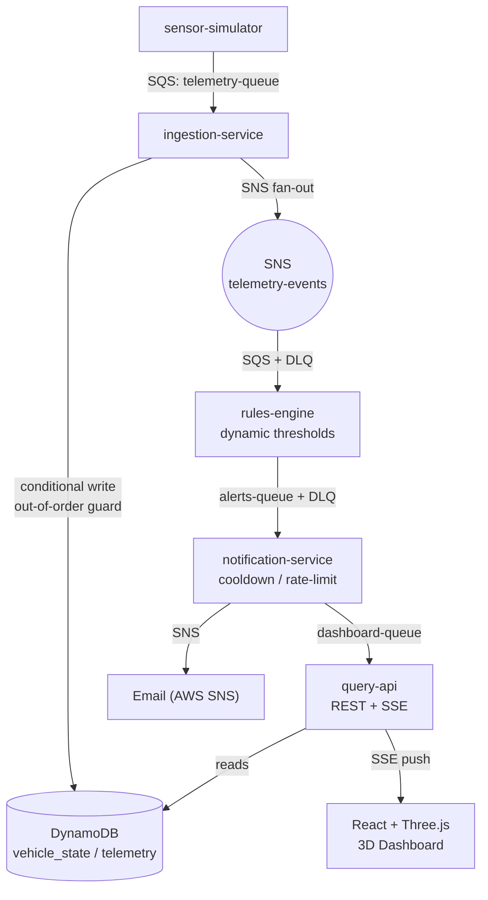
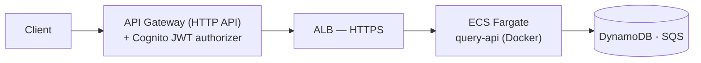

# Vehicle Maintenance Alert System

[](https://github.com/celilensar/arac-bakim-sistemi/actions/workflows/deploy.yml)


An **event-driven microservice platform** that processes simulated vehicle sensor data
(engine temperature, oil life, tire pressure, battery voltage, mileage) to produce
maintenance alerts in real time — and ships end-to-end to **AWS**, with the whole cloud
infrastructure defined as **Terraform code (IaC)**.

Built to practice, at production quality: Spring Boot microservices, message queues
(SQS/SNS), resilient event pipelines, containerization, and cloud deployment.

> **Stack:** Java · Spring Boot · AWS (ECS Fargate, ECR, API Gateway, Cognito, DynamoDB, SQS, SNS, IAM, CloudWatch, ALB) · Terraform · Docker · LocalStack · React + Three.js

---

## Architecture

Five decoupled Spring Boot services communicating asynchronously through SQS queues and
SNS fan-out. Every stage is independently deployable and independently fails safe.



### Cloud deployment (production path)

`query-api` is containerized and deployed on AWS behind a single, authenticated entry point.
The entire stack below is provisioned from code with Terraform.



*Without a valid Cognito JWT the gateway returns `401`; with a valid token, `200`.*

---

## Key engineering highlights

- **Event-driven & decoupled** — SQS point-to-point + SNS fan-out; a slow or failing
  consumer never blocks the chain.
- **Resilience** — Dead-Letter Queues with redrive policy (`maxReceiveCount`), consumer
  **idempotency**, and graceful retry via SQS visibility timeout.
- **Out-of-order protection** — `vehicle_state` uses DynamoDB **conditional writes**
  (`attribute_not_exists OR #ts < :newTs`) so a late, stale reading can never overwrite
  fresher state.
- **Alert fatigue control** — per-`(vehicle, rule)` **cooldown / rate limiting** in the
  notification service.
- **Dynamic thresholds** — rules read from a DynamoDB table and refresh periodically,
  so limits change **without a redeploy**.
- **Real-time push** — `query-api` streams live alerts to the browser via
  **Server-Sent Events (SSE)**.
- **12-Factor config** — identical code runs against **LocalStack** locally and real AWS
  in the cloud; only environment/profile changes (`SPRING_PROFILES_ACTIVE=aws`).
- **Infrastructure as Code** — the full ECS/ALB/IAM/networking stack is defined in
  Terraform: provision or tear down with a single command, fully reproducible.

---

## Services

| Module | Responsibility |
|--------|----------------|
| `sensor-simulator` | Emits periodic telemetry for N vehicles to `telemetry-queue` |
| `ingestion-service` | Consumes telemetry → writes history + `vehicle_state` (conditional) → SNS fan-out |
| `rules-engine` | Applies data-driven thresholds → produces alerts + `alerts-queue` (+ DLQ) |
| `notification-service` | Severity filter + cooldown → publishes to SNS (email) |
| `query-api` | REST `/api/fleet` (fleet state) + SSE `/api/stream/alerts` (live push) |
| `dashboard/` | React + Vite + Three.js glassmorphism 3D dashboard |
| `infra/` | LocalStack setup, IAM policies, and Terraform (IaC) |

---

## Run locally (LocalStack — no AWS cost)

**Requirements:** JDK 21, Docker, (optional) AWS CLI.

```bash
# 1) Start local AWS (LocalStack) + create resources
docker compose up -d

# 2) Start the pipeline (each in its own terminal)
cd ingestion-service && ./mvnw spring-boot:run
cd sensor-simulator  && ./mvnw spring-boot:run
cd rules-engine      && ./mvnw spring-boot:run
cd notification-service && ./mvnw spring-boot:run
cd query-api         && ./mvnw spring-boot:run   # http://localhost:8080/api/fleet

# 3) Dashboard
cd dashboard && npm install && npm run dev        # http://localhost:5173
```

## Deploy to AWS (Terraform)

The container image is built (multi-stage Docker) and pushed to ECR; the rest is code.

```bash
cd infra/terraform
terraform init

# provide your own ECR image (account id is NOT committed to this repo)
echo 'image_uri = "<ACCOUNT_ID>.dkr.ecr.eu-central-1.amazonaws.com/query-api:latest"' > terraform.tfvars

terraform apply      # provisions ECS Fargate + ALB + IAM + security groups + service
terraform output alb_url
terraform destroy    # tears everything down (cost back to zero)
```

---

## Project structure

```
arac-bakim-sistemi/
├── sensor-simulator/       # telemetry producer
├── ingestion-service/      # SQS consumer → DynamoDB + SNS
├── rules-engine/           # threshold evaluation → alerts
├── notification-service/   # cooldown + SNS notifications
├── query-api/              # REST + SSE, containerized (Dockerfile)
├── dashboard/              # React + Three.js 3D UI
└── infra/
    ├── init/               # LocalStack resource bootstrap
    ├── aws/                # IAM trust policies
    └── terraform/          # full cloud stack as code (IaC)
```

---

*Personal learning & portfolio project — designed and built end to end, from local
event-driven pipeline to authenticated, Terraform-provisioned AWS deployment.*
