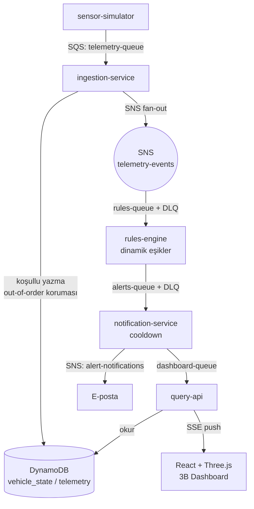
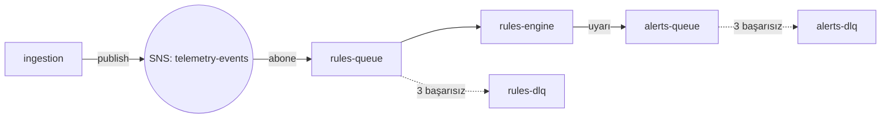
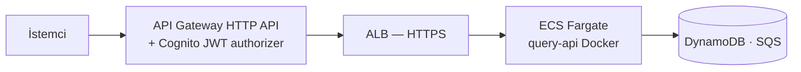
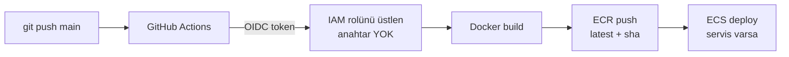
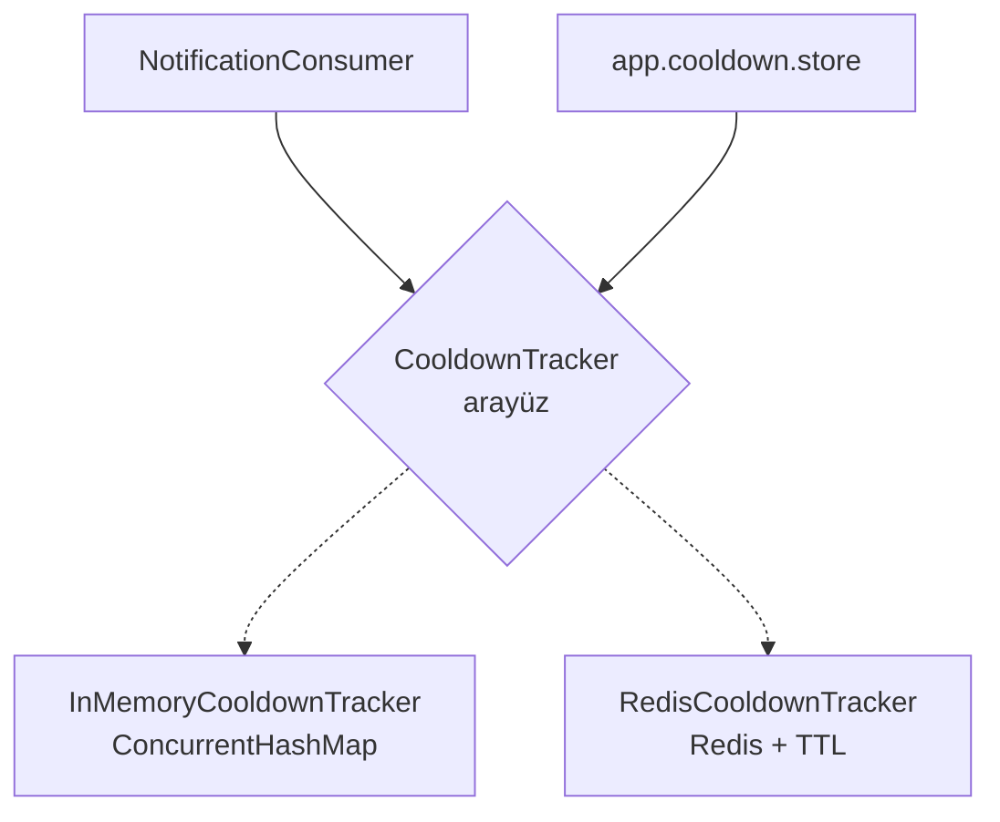

# Geliştirme Yolculuğu — Araç Bakım Uyarı Sistemi

Bu belge projenin sıfırdan bugüne nasıl geliştiğini; hangi kararların **neden**
alındığını ve her adımda **ne öğrenildiğini** anlatır.

---

## 1. Proje nedir?

Simüle edilmiş araç sensör verilerini (motor sıcaklığı, yağ ömrü, lastik basıncı,
akü voltajı, kilometre) işleyerek **bakım uyarıları** üreten, **olay güdümlü** bir
mikroservis sistemi. Amaç: gerçek bir sistem kurarak AWS, Spring Boot mikroservis,
mesaj kuyrukları, bulut deployment, IaC ve CI/CD konularını uçtan uca öğrenmek.

**Geliştirme ortamı:** lokalde [LocalStack](https://localstack.cloud) (Docker'da sahte
AWS — ücret yok) + Redis. Buluta çıkarken aynı kod gerçek AWS'de çalışır (12-Factor).

---

## 2. Mimari — genel bakış

Beş bağımsız Spring Boot servisi, SQS kuyrukları ve SNS fan-out ile **asenkron**
haberleşir. Her aşama tek başına dağıtılabilir ve tek başına güvenli şekilde hata verir.



**Servisler:**

| Servis | Görevi |
|--------|--------|
| `sensor-simulator` | Periyodik sahte telemetri üretir → `telemetry-queue` |
| `ingestion-service` | Telemetriyi tüketir → DynamoDB'ye yazar → SNS fan-out |
| `rules-engine` | Veri-güdümlü eşikleri uygular → uyarı üretir (+ DLQ) |
| `notification-service` | Seviye filtresi + cooldown → SNS bildirim |
| `query-api` | REST `/api/fleet` + SSE `/api/stream/alerts` |
| `dashboard/` | React + Vite + Three.js glassmorphism 3B arayüz |

---

## 3. Faz 1 — Çekirdek akış

İlk hedef: en basit uçtan uca hat.

```
[Simülatör] → [SQS] → [Ingestion] → [DynamoDB] ← [Query API]
```

- **SQS (Simple Queue Service):** noktadan-noktaya kuyruk. Simülatör mesaj basar,
  ingestion **long-polling** ile okur. Kuyruk sayesinde üretici ve tüketici
  **gevşek bağlı** (decoupled) olur.
- **DynamoDB:** NoSQL tablo. `telemetry` (partition=vehicleId, sort=timestamp).
- **Öğrenilen:** mesaj işlenince silinir; hata olursa silinmez → *visibility timeout*
  ile otomatik tekrar denenir.

---

## 4. Faz 2 — Mesajlaşma + kurallar



- **SNS fan-out:** ingestion telemetriyi bir topic'e yayınlar; topic'e abone olan
  kuyruklara mesaj **otomatik kopyalanır**. İleride yeni tüketici eklemek kolay.
- **DLQ (Dead-Letter Queue) + redrive:** bir mesaj 3 kez işlenemezse (zehirli mesaj)
  otomatik olarak DLQ'ya taşınır → ana akış tıkanmaz, sorunlu mesaj incelenebilir.
- **Öğrenilen:** SQS `RedrivePolicy` gibi JSON attribute'ları CLI kısayoluyla değil
  tam JSON ile verilmeli.

---

## 5. Faz 3 — Bildirim + dashboard

- **notification-service:** uyarıları seviyeye göre filtreler (KRITIK/UYARI), bir SNS
  topic'ine yayınlar. Gerçek AWS'de bu bir **e-posta** aboneliğine bağlandı (çalışan demo).
- **query-api + SSE:** `dashboard-queue`'yu tüketip tarayıcıya **anlık** uyarı iter.
- **Dashboard:** React + Vite + **Three.js** ile tam ekran 3B araç; glassmorphism paneller,
  canlı SSE uyarı akışı.

---

## 6. Hocanın 4 mimari önerisi (uygulandı)

3. hafta sunumundan sonra danışman hoca dört öneri verdi; dördü de uygulandı:

| # | Öneri | Çözüm |
|---|-------|-------|
| 1 | **Dinamik eşik yönetimi** | Eşikler koddan çıkıp `thresholds` DynamoDB tablosuna taşındı; `ThresholdProvider` 30 sn'de bir yeniler → **restart gerekmeden** değişir |
| 2 | **Alert fatigue** | notification-service'te (araç+kural) başına **cooldown / rate limiting** |
| 3 | **Gerçek zamanlı push** | Polling yerine **SSE** ile tarayıcıya anlık iletim |
| 4 | **Zaman damgası tutarlılığı** | `vehicle_state`'e **koşullu yazma** (`#ts < :newTs`) → geç gelen eski ölçüm güncel durumu ezemez |

---

## 7. Faz 4 — Buluta deployment

`query-api` konteynerleştirilip gerçek AWS'ye alındı; önüne tek güvenli giriş kapısı kondu.



**Adımlar:**
1. **Multi-stage Docker** → küçük, güvenli image (build araçları son image'da yok)
2. **ECR** (Elastic Container Registry) → image'ın bulut deposu
3. **ECS Fargate** → sunucusuz konteyner; ALB arkasında HTTPS
4. **API Gateway** → tek giriş kapısı
5. **Cognito JWT** → token'sız **401**, geçerli token **200**

**Öğrenilen / gerçek problemler:**
- **App Runner** yeni müşteri almayı durdurunca → **ECS Express Mode**'a pivot.
- **503 hatası** → CloudWatch loglarından teşhis: eksik `SPRING_PROFILES_ACTIVE=aws`
  env değişkeni yüzünden uygulama `localhost`'a bağlanıyordu (image immutability dersi).

---

## 8. IaC — Terraform

ECS Express'in tıklayarak kurduğu her şey **kod olarak** yeniden yazıldı (`infra/terraform/`).

```
main.tf · variables.tf · iam.tf · ecs.tf · alb.tf · service.tf · outputs.tf
```
- **Workflow:** `init` → `plan` → `apply` → `destroy`
- **State + idempotency:** Terraform ne oluşturduğunu hatırlar; aynı komut güvenle tekrar çalışır.
- **Faydası:** **tek komutla kur / tek komutla yık** — bulutu sürekli ödemek yerine
  istenince açılır, bitince kapatılır. (Boşta unutulan bir ALB $16/ay ücret üretmişti;
  ders: IaC ile `destroy` her şeyi temizler.)
- **Öğrenilen:** `.gitignore` **satır-sonu yorum desteklemez** (state dosyaları yanlışlıkla
  commit'e girecekti, `git add -n` ile yakalandı); AWS security group açıklaması `'` kabul etmez.

---

## 9. CI/CD — GitHub Actions

Her `git push`'ta otomatik build + ECR push + (servis varsa) deploy.



- **OIDC (OpenID Connect):** GitHub, AWS'ye **uzun ömürlü anahtar** vermeden, anlık
  imzalı token ile bir IAM rolünü üstlenir. Trust policy sadece **bu repo'ya** kısıtlı.
- **Dayanıklı deploy:** ECS servisi kapalıysa adım "atlandı" deyip **yeşil** kalır.

---

## 10. Kalite — Testler

- **RuleEngine unit testleri** (JUnit + Mockito): `ThresholdProvider` mock'lanarak eşik
  mantığı izole test edildi (GT/LT, sınır değeri, çoklu eşik, alertId formatı).
- **CooldownTracker unit testleri:** cooldown mantığı **ayrı saf sınıfa çıkarıldı**
  (testability refactor). Zaman-bağımlı test için **Clock enjeksiyonu** → `Thread.sleep`
  olmadan, `advanceSeconds` ile zaman ileri sarılarak deterministik test.
- **RedisCooldownTracker entegrasyon testi** (**Testcontainers**): testte Docker'da
  **gerçek Redis** ayağa kaldırılıp doğru yazma/okuma ve TTL davranışı kanıtlanır.
  Unit (mock, hızlı) + integration (gerçek, yavaş) + smoke (`contextLoads`) → **test piramidi**.
- **Öğrenilen:** "test etmesi zorsa, tasarım kokusudur → ayrıştır." Ayrıca: unit'te
  zamanı `Clock` ile kontrol ederiz; integration'da gerçek TTL gerçek zamanda işler (kısa bekleme).

---

## 11. Redis — dağıtık cooldown

**Sorun:** in-memory cooldown tek instance'ta çalışır; yatay ölçeklemede her kopyanın
kendi hafızası olur → **duplicate bildirim.**

**Çözüm — Strategy pattern + Redis (TTL):**



- `CooldownTracker` **arayüze** çevrildi; iki uygulama (memory / redis) `@ConditionalOnProperty`
  ile seçilir. Consumer hangisinin geldiğini **bilmez** → depoyu değiştirmek Consumer'ı hiç etkilemez.
- **Redis TTL zarafeti:** anahtar 120 sn ömürle yazılır, süre dolunca Redis onu **kendisi siler**
  → elle zaman hesabına gerek yok. `redis-cli TTL cooldown:VH-001#ENGINE_OVERHEAT` ile geri sayım görülür.

---

## 12. Teknoloji yığını

- **Diller/çerçeveler:** Java, Spring Boot, React + Vite, Three.js
- **AWS:** ECS Fargate, ECR, API Gateway, Cognito, DynamoDB, SQS, SNS, IAM, CloudWatch, ALB
- **Altyapı:** Docker (multi-stage), Terraform (IaC), GitHub Actions (CI/CD), LocalStack, Redis
- **Kavramlar:** olay güdümlü mimari, DLQ, idempotency, SSE, cooldown/rate-limiting,
  Strategy pattern, OIDC, 12-Factor

---

## 13. Öne çıkan kararlar & öğrenilenler

- **LocalStack ile geliştir, gerçek AWS'ye env ile geç** → tek kod, sıfır lokal maliyet.
- **Kimlik bilgisi asla koda/GitHub'a yazılmaz** → lokalde `~/.aws`, bulutta IAM rolü, CI'da OIDC.
- **IaC = maliyet kontrolü** → kur/yık kodla; boşta kaynak bırakma.
- **Testability için ayrıştır** → saf mantık ayrı sınıfta, kolay test.
- **Gerçek hata çözme** → App Runner pivotu, 503 log teşhisi, gitignore tuzağı.

---

## 14. Sırada ne var

```
FAZ A · Testler  ✅ (unit: RuleEngine + CooldownTracker · integration: Testcontainers/Redis)
FAZ B · Redis    ✅ (dağıtık cooldown + TTL)
FAZ C · Observability  ⬜ (Actuator + Prometheus + Grafana)
FAZ D · Kafka          ⬜ (event-driven alternatif)
FAZ E · Opsiyonel      ⬜ (Elasticsearch · WebSocket · Spring Batch)
```

*Kişisel öğrenme & portföy projesi — lokal olay güdümlü hattan, kimlik doğrulamalı ve
Terraform ile kurulan bulut dağıtımına kadar uçtan uca tasarlanıp geliştirildi.*
