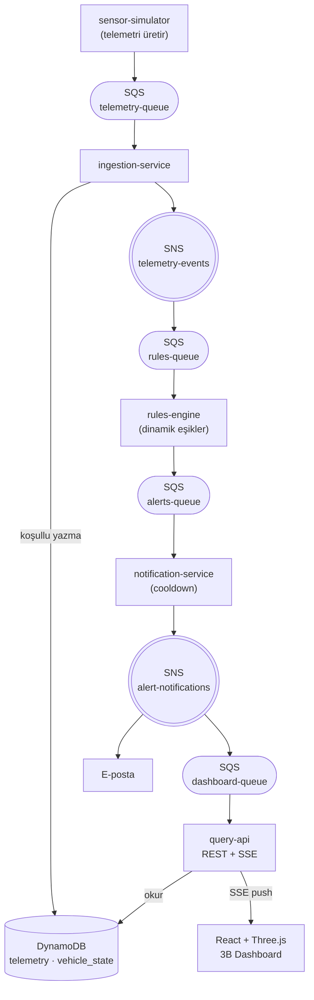
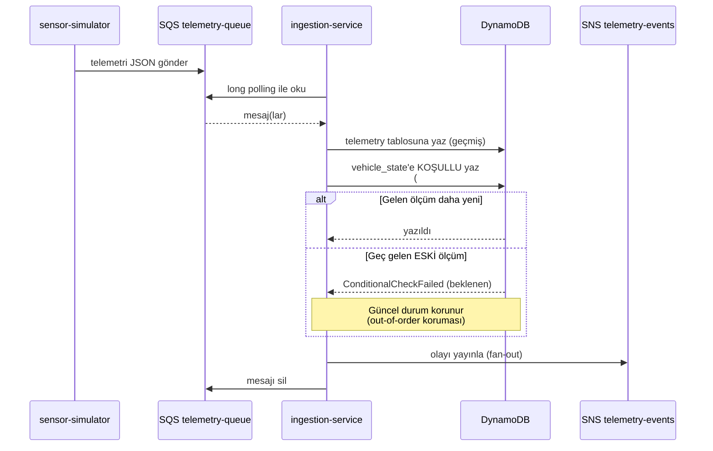
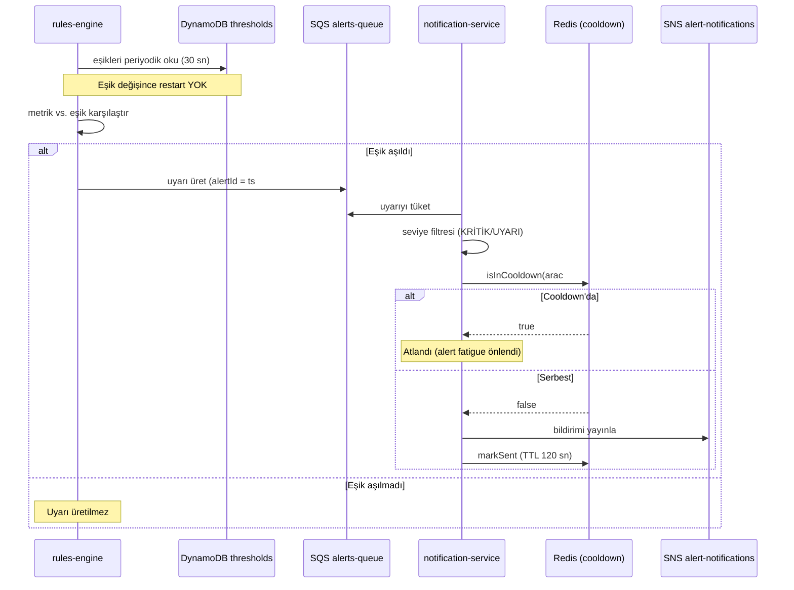
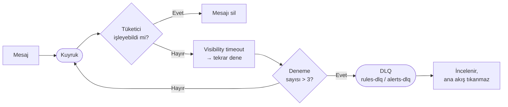
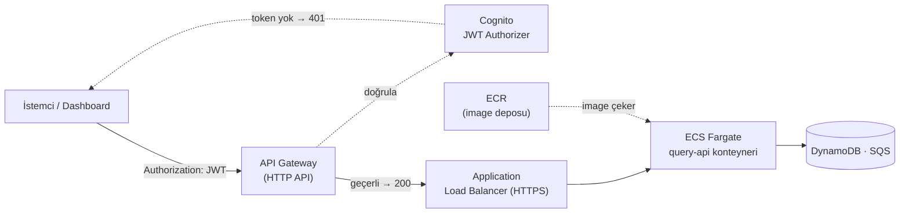
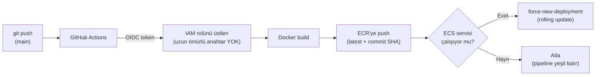
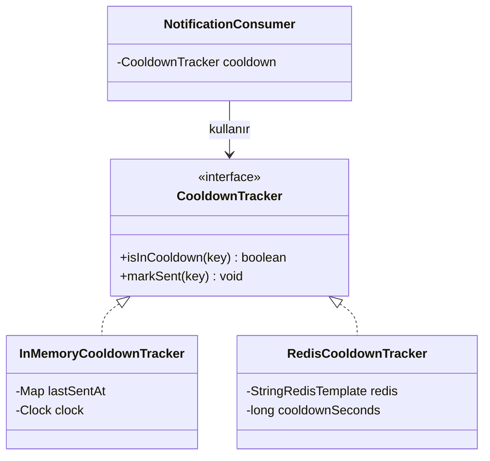
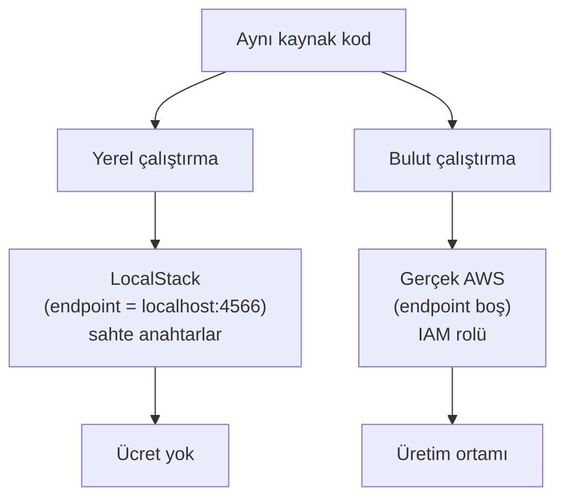

# Mimari ve Akış Diyagramları

Bu belge, Araç Bakım Uyarı Sistemi'nin mimarisini ve temel akışlarını görselleştirir.
(GitHub bu `mermaid` bloklarını otomatik çizer.)

---

## 1. Sistem Mimarisi — Genel Görünüm

Beş bağımsız Spring Boot servisi; SQS kuyrukları ve SNS fan-out ile **asenkron** haberleşir.

---

## 2. Telemetri Akışı (sequence)

Bir sensör okumasının sisteme girişten veritabanına yazılmasına kadarki yolu.

---

## 3. Uyarı Üretimi ve Bildirim Akışı

Eşik aşımından kullanıcıya bildirime kadar.

---

## 4. Dayanıklılık — DLQ (Dead-Letter Queue) Akışı

İşlenemeyen "zehirli" mesaj ana akışı tıkamaz.

---

## 5. Bulut Dağıtım Mimarisi (AWS)

İstemciden veritabanına kadar üretim yolu.

---

## 6. CI/CD Akışı (GitHub Actions + OIDC)

Anahtarsız kimlik ile otomatik dağıtım.

---

## 7. Cooldown — Strategy Pattern

Aynı arayüz, değiştirilebilir depo: bellek veya Redis.

**Neden:** In-memory cooldown yalnızca tek instance'ta çalışır; yatay ölçeklemede her kopyanın
kendi hafızası olduğu için aynı uyarı birden çok kez gönderilir. Redis (TTL) ile durum
instance'lar arasında paylaşılır ve mükerrer bildirim önlenir.

---

## 8. Yerel Geliştirme ve Bulut Geçişi (12-Factor)

Aynı kod, farklı ortam.

